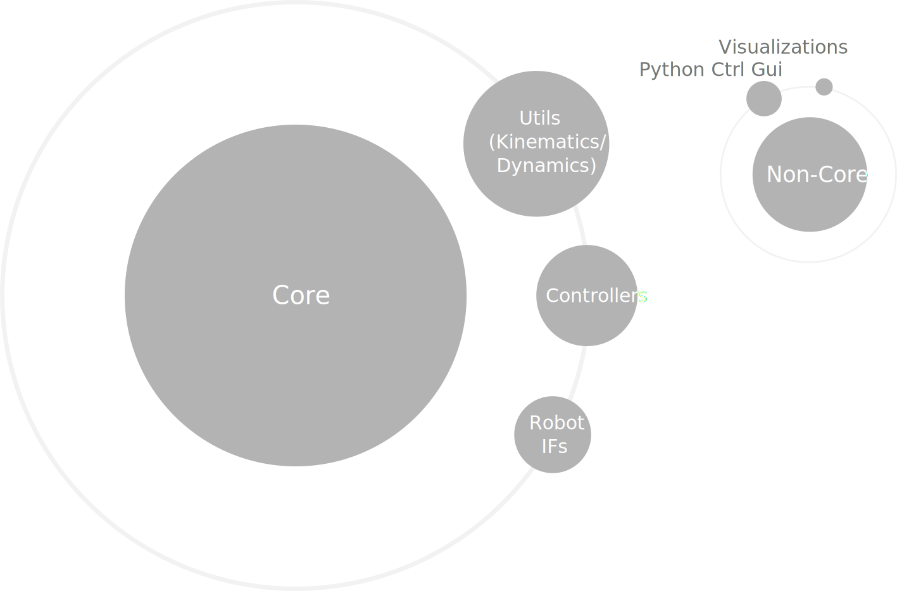

  <h1>CoSiMA Component Library Overview</h1>

Apart from the dependencies of CoSiMA (incl. 3rd party libraries), which can be found at [CITK Open Source](https://toolkit.cit-ec.uni-bielefeld.de/systems/versions/cogimon-minimal-simulation-distribution-nightly),
we provide several libraries that contain functional extensions to CoSiMA (e.g., robot interface components,
kinematics and dynamics calculations, general control components, etc.).

## CCL Structure
Such a library needs to meet the requirements of a **CoSiMA Component Library (CCL)**.
To combine modelling at DSL level and component implementations using a general-purpose
programming language (in particular C++), it demands to contain a
GPL as well as DSL representation for the contained components that makes them available in
the modelling tools.  
Libraries following the scheme of CCL, should be organized according to
high cohesion and a minimal dependency footprint. For instance, OROCOS-RTT components
with focus on projected-dynamics calculations yield one library, while Gazebo visualization
plugins are contained in another one. For instance, even though robot interface components and
kinematic joint-space controller are both OROCOS-RTT based, they would not be in the same
library due to their low cohesion.

## Core vs. Non-Core Libraries

All libraries related to the **core** of CoSiMA will be maintained and publicly available.
In contrast to that, **non-core** functionality might not be maintained or entirely available
and hence not always up-to-date or compatible with the latest version of the framework.
It resembles all the parts that are specific for our research scenarios as well as optional visualizations and interaction components.
A brief overview of the non-core components is presented below:

| Name  | Description |
| :--- | :--- |
| --- | --- |
| [Gazebo Trajectory Visualization Plugin](https://github.com/corlab/gazebo-trajectory-visualization-plugin) | Gazebo plugin to visualize a trajectory |
| [CogIMon Experimental](https://github.com/corlab/cogimon-experimental) | Experimental script to interact with the Orocos environment via RSB |
