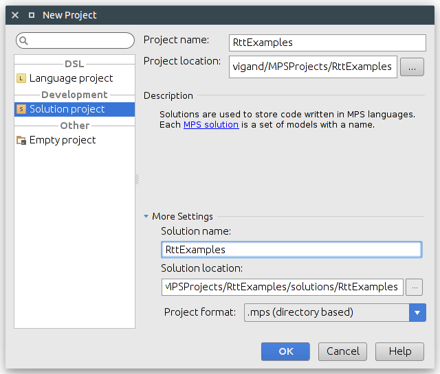
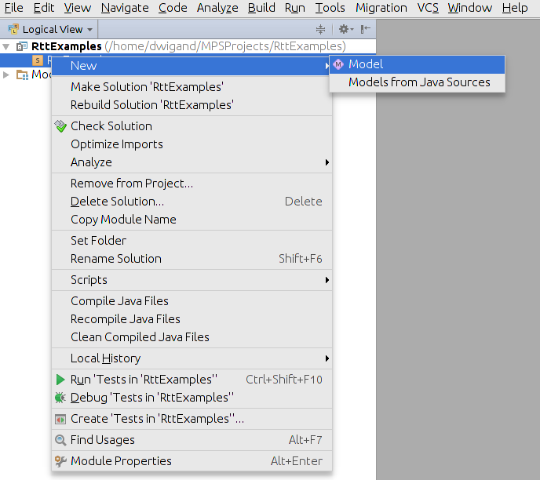
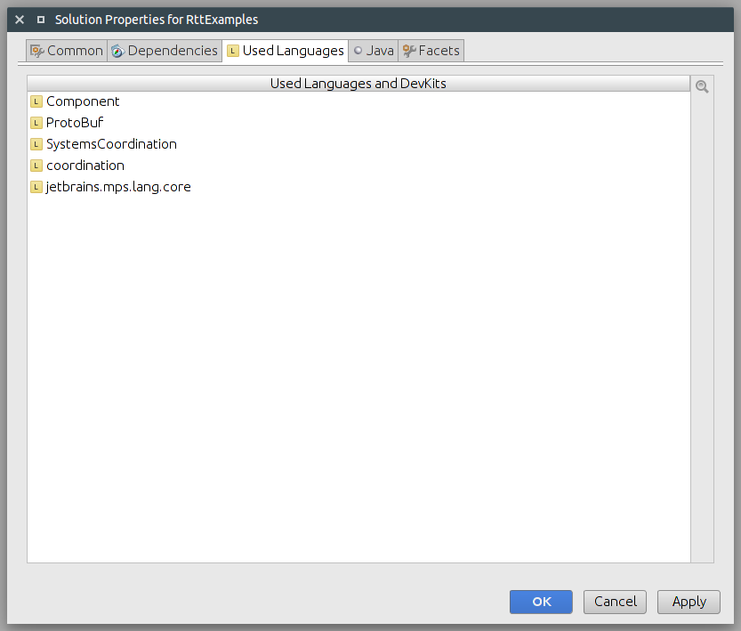
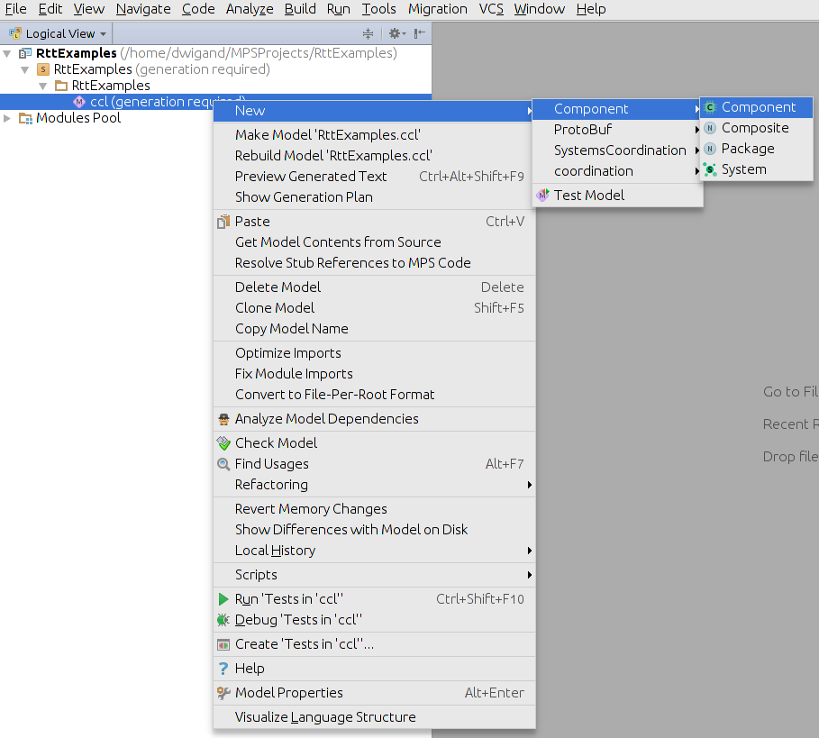
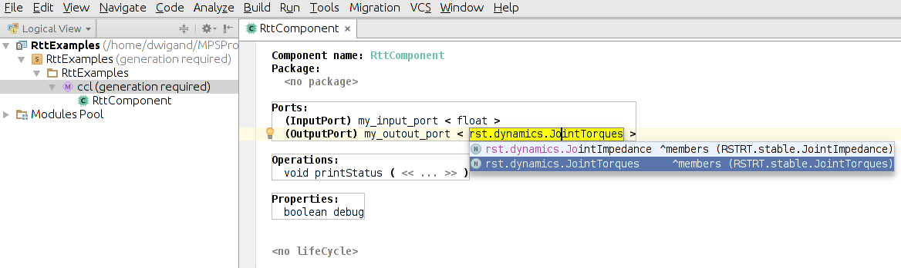
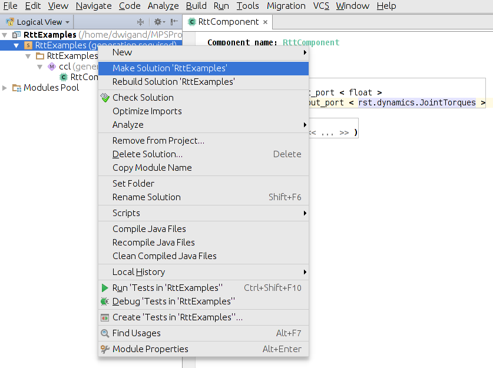

<style>
  h3 {
    margin: 40px 0px 20px 0px;
  }
</style>
<div class="page-header">
  <h1>Creating a new RTT Component for CoSiMA</h1>
</div>

It may happen that you are missing some functionality for your robotic system, which is not present amongst the predefined components in the [CogIMon Component Library (CCL)](/ccl/overview.html). In such a case you may need to create your own components that contains the desired functionality.
These instructions present the common way to create a CoSiMA-conform Orocos RTT component, which can then be used with the modelling tools.

### Implementing the Orocos RTT Component

1. To boost productivity, we've created a template to download from our Github.
```bash
$ git clone https://github.com/cogimon/rtt-component-template.git
```
The content look like this:
```sh
$ cd rtt-component-template && tree .
.
├── CMakeLists.txt
├── include
│   └── simple-rtt-component.hpp
├── ops
│   └── simple_example.ops
├── README.md
└── src
       └── simple-rtt-component.cpp
```
2. Change the name of the component in the **.cpp / .hpp** and the **CMakeLists.txt** to reflect its intended functionality.  
In CMakeLists.txt:
    ```cmake
    #..[ omitted ]..

    #
    # This creates a standard cmake project. You may extend this file with
    # any cmake macro you see fit.
    #
    project(sample-rtt-component) #  <--- Change the name

    #..[ omitted ]..

    orocos_component(
      ${CMAKE_PROJECT_NAME}
      ${PROJECT_SOURCE_DIR}/include/simple-rtt-component.hpp #  <--- Change the name
      ${PROJECT_SOURCE_DIR}/src/simple-rtt-component.cpp #  <--- Change the name
    ) #  <--- you may add multiple source files

    #..[ omitted ]..
    ```  
In **.cpp / .hpp**:
    ```c++
    #include "simple-rtt-component.hpp" //  <--- Change the name

    //..[ omitted ]..

    RttComponent::RttComponent(std::string const & name) : RTT::TaskContext(name) {} //  <--- Change the name

    //..[ omitted ]..

    // This macro, as you can see, creates the component. Every component should have this!
    ORO_CREATE_COMPONENT_LIBRARY()ORO_LIST_COMPONENT_TYPE(RttComponent) //  <--- Change the name
    ```
3. Perform an out-of-source compilation inside the **rtt-component-template** folder and verify that the template compiles.
```sh
$ mkdir build && cd build
$ cmake -DCMAKE_INSTALL_PREFIX=<path-to-your-CoSiMA-installation> ..
$ make
```
4. Change the functional implementation to your liking, see [The Orocos Component Builder's Manual](http://www.orocos.org/stable/documentation/rtt/v2.x/doc-xml/orocos-components-manual.html) as API reference. Further **Do's and Don'ts** are outlined at the end of this section.

### Making the Component Available for CoSiMA

1. Make sure that your latest code has compiled properly.
2. Verify that you have the following **orocos** folder in your **build** folder:
```bash
$ tree orocos
orocos
└── gnulinux
    └── RttExamples  #  <--- Name of the component library
        └── libRttExamples-gnulinux.so  #  <--- Component library
```
3. Source the CoSiMA setup script.
```bash
$ source <path-to-your-CoSiMA-installation>/bin/setup-cogimon-env.sh
```
4. Extend the **RTT_COMPONENT_PATH** by your new library (**orocos** folder).
```bash
$ export RTT_COMPONENT_PATH=$RTT_COMPONENT_PATH:<path-to-your-component-librarys-build-folder>/orocos
```
5. Launch the **deployer** or **deployer-\<os\>**.
    ```bash
    $ deployer-gnulinux
    Real-time memory: 517904 bytes free of 524288 allocated.
       Switched to : Deployer

      This console reader allows you to browse and manipulate TaskContexts.
      You can type in an operation, expression, create or change variables.
      (type 'help' for instructions and 'ls' for context info)

        TAB completion and HISTORY is available ('bash' like)

        Use 'Ctrl-D' or type 'quit' to exit this program.

    Deployer [S]> import("RttExamples") #  <--- Name of the component library
     = true

    Deployer [S]> displayComponentTypes
    I can create the following component types:
       OCL::ConsoleReporting
       OCL::FileReporting
       OCL::HMIConsoleOutput
       OCL::HelloWorld
       OCL::NetcdfReporting
       OCL::TcpReporting
       OCL::TimerComponent
       OCL::logging::Appender
       OCL::logging::FileAppender
       OCL::logging::GenerationalFileAppender
       OCL::logging::LoggingService
       OCL::logging::OstreamAppender
       OCL::logging::RollingFileAppender
       TaskContext
       RttComponent #  <--- Name of a component from the library
     = (void)

    Deployer [S]> loadComponent("name-component-inst", "RttComponent") #  <--- Name of a component from the library
    ```

### Represent the Component in the Modelling Environment

1. Start the **CoSiMA IDE** and create a **new project solution**.

    
2. Create a **new model** and name it **ccl**.

    
3. Include the following **dependencies**.

    
4. Create a **new component** in the model.

    
5. **Represent the component** as it is in the c++ implementation.

    
6. **Compile** the project solution.

    

### Do's and Don'ts

- **DO** implement in a real-time safe and capable way!
- **DO** group components with high cohesion together!

- **DON'T** generate the component interface (i.e. ports, operations, properties) in a magical way, since this is currently not supported by the modelling environment!
- **DON'T** allocate memory in the updateHook!
- **DON'T** use assertions or any other mechanisms that can lead to unforeseen segfaults of the whole system. That's just DANGEROUS!
