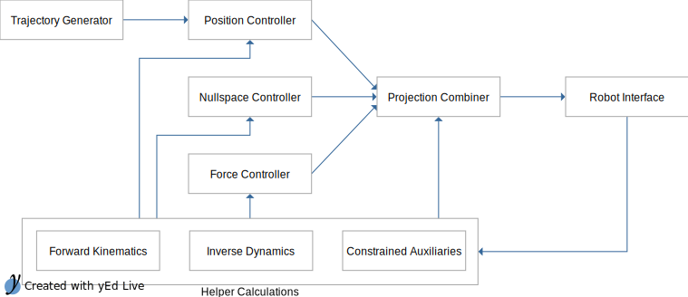

  <h1>Code generation for a proj. dynamics controller</h1>

This advanced example demonstrates how to model a domain example using the
CogIMon DSL Workbench with the ultimate goal to generate executable code.
Here, the domain example is based on a projected dynamics controller,
presented in Ortenzi2014[^1], that drives a single arm robot (i.e. the Kuka LWR 4+)
to perform a wiping motion on a white board while applying a predefined amount
of force in the direction of the board.

The generated artifact is an [Orocos Program Script](http://www.orocos.org/stable/documentation/rtt/v2.x/doc-xml/orocos-components-manual.html#program-syntax),
which is used to deploy computational code in form of Orocos components into an Orocos execution environment.
These kind of scripts can combine that static and dynamic view of a system,
by instantiating, configuring and connecting Orocos components and their (data-flow driven) communication network.

The experiment is executed on the [CogIMon Simulation Architecture](/simulation/simulation.html) and the necessary computational code is available as Orocos components in the [CogIMon Component Library (CCL)](/ccl/overview.html).

### Mapping the Domain Example to the DSL Concepts

The core parts of the domain example presented in the paper[^1] is resembled by the following equation:

$$\Large \tau=PJ^TF+PN\tau_{0} + \tau_{C}$$

After analysing the equations,
the key aspects of the domain example are extracted with the DSL concepts of a component-based system representation in mind.
A very abstract representation of the projected dynamics control system is shown in the following figure.
The actual model is much more detailed.

### Modeling the Static View of the System

Based on the insights gained in the previous step,
the static view of the system is modeled in the CogIMon DSL Workbench.
This step consists of drawing on the necessary computational parts from the CCL
and connecting the data-flow between those components.
Eventually a platform-independent model is created that is similar to the previous illustration.



### Modeling the Dynamic View

In this step, the coordination of the components is modeled.
Here, the components can be configured and adapted to task-dependent needs.



### Platform Mapping: Orocos

In order to execute the created model, it needs to be mapped to a software platform,
which in this case is Orocos. Mapping a model to a software platform introduces
platform-specific (i.e. Orocos-specific) constraints or requirements on the model
and enables code generation for the particular platform.
Here, the execution frequency and scheduling configuration needs to be modeled.



### Code Generation and Experiment Execution

Through multiple model-to-model and eventually a model-to-text transformation,
an Orocos Program Script is generated from the model.
Once this script is fed to the Orocos Deployer, all components are instantiated,
configured and connected according to the created model.



### References

[^1]: [V. Ortenzi, M. Adjigble, J. A. Kuo, R. Stolkin and M. Mistry, "An experimental study of robot control during environmental contacts based on projected operational space dynamics," 2014 IEEE-RAS International Conference on Humanoid Robots, Madrid, 2014, pp. 407-412.](http://ieeexplore.ieee.org/document/7041392/)
