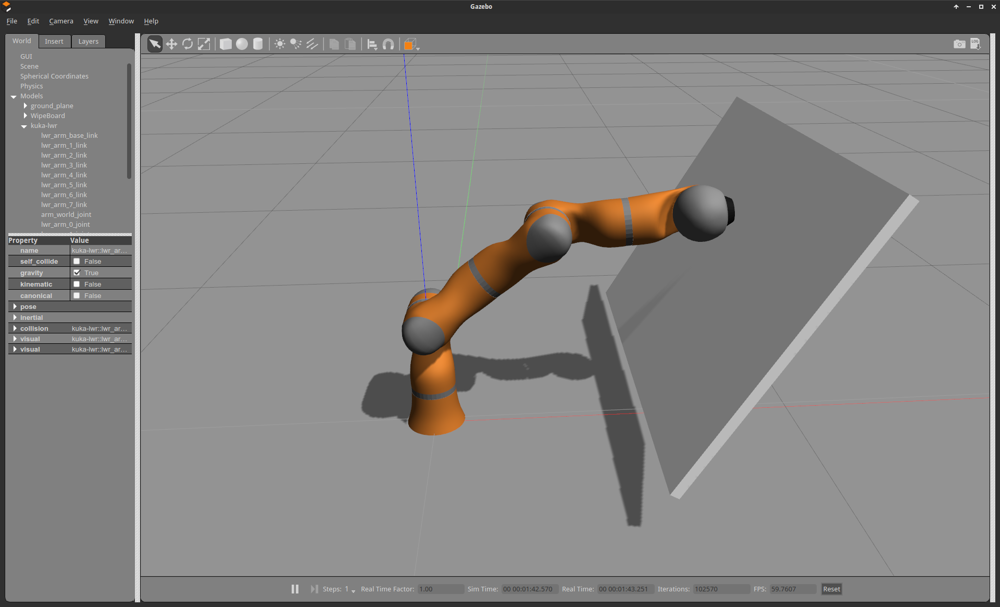

  <h1>Available Robot Models</h1>

## [KUKA LWRIV+ Model](https://github.com/corlab/cogimon-gazebo-models/tree/master/kuka-lwr-4plus)

Contains the URDF and geometric description (with inertia matrices) of the KUKA LWR 4+.

## [COMAN Model](https://github.com/corlab/cogimon-gazebo-models/tree/master/iit-coman)

Contains the URDF and geometric description (with inertia matrices) of the COMAN (coman_urdf).

