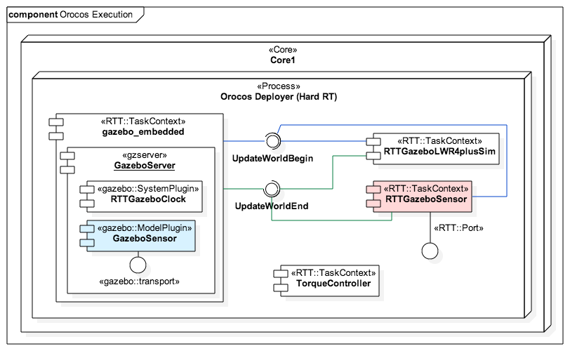

  <h1>CoSimA Overview</h1>

## Gazebo/Orocos Integration Components

#### [RTT Gazebo Embedded](https://github.com/corlab/rtt-gazebo-embedded)

This [Orocos RTT](http://www.orocos.org/rtt) component embeds an instance of [Gazebo](http://gazebosim.org/) into the Orocos environment. It provides an interface that allows the interaction between Gazebo and Orocos. Thus, e.g., robot models can be loaded into the simulation environment of Gazebo. The component is forked from the [Institut des systèmes intelligents et de robotique (ISIR)](https://github.com/kuka-isir/rtt_gazebo_embedded).

#### [RTT Gazebo Clock Plugin](https://github.com/corlab/rtt-gazebo-clock-plugin.git)

Gazebo system plugin to sync the RTT time to the simulation of Gazebo. This plugin will be loaded into the embedded instance of Gazebo.
It is based on [Antoine Hoarau's fork](https://github.com/ahoarau/rtt_gazebo/tree/master/rtt_gazebo_system).
