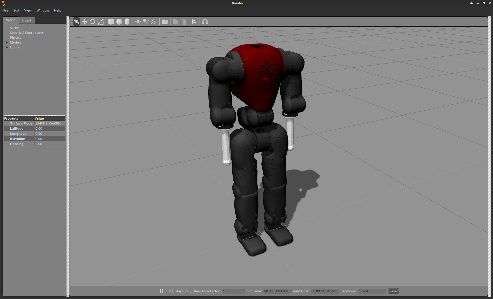

  <h1>Open Source Software Components</h1>

The following packages are provided on GitHub for the [Gazebo](http://gazebosim.org/) simulation of the KUKA LWR 4+ and the COMAN. Please follow the links in the headings in order to fork the individual components.

## General Gazebo Components

#### [RTT Gazebo World Plugin](https://github.com/corlab/rtt-gazebo-world-plugin.git)

Gazebo world plugin that instantiates an [RTT](http://www.orocos.org/rtt) environment and provides an interface to load robot models and RTT components. It also associates a robot model with a RTT component, to enable data-flow between the two worlds.

#### [RTT Gazebo Clock Plugin](https://github.com/corlab/rtt-gazebo-clock-plugin.git)

Gazebo system plugin to sync the RTT time to the simulation of Gazebo.

#### [RSB Model State Plugin](https://github.com/corlab/gazebo-rsb-model-state-plugin.git)

Gazebo model plugin that publishes the current pose of a model inside Gazebo in a fixed interval to [RSB](http://docs.cor-lab.de//rsb-manual/trunk/html/index.html).

## Robot Model Descriptions 

#### [KUKA LWRIV+ Model](https://github.com/corlab/lwr-robot-description.git)

Contains the URDF and geometric description (with inertia matrices) of the KUKA LWR 4+.

#### [COMAN Model](https://github.com/EnricoMingo/iit-coman-ros-pkg.git)

Contains the URDF and geometric description (with inertia matrices) of the COMAN (coman_urdf).

## LWR-specific Components 

#### [RTT Gazebo LWR Integration](https://github.com/corlab/rtt-gazebo-lwr-integration.git)

RTT component using a Gazebo model pointer of an associated robot model to provide an interface into the RTT world, which enables other RTT components to send and receive positions, velocities and torques in joint space to and from the simulated robot respectively.

#### [RTT Gazebo LWR Simulation](https://github.com/corlab/rtt-gazebo-lwr-simulation.git)

RTT component that simulates the hardware control-box of the LWR 4+. It provides the possibility to choose between different control modes, such as position control, direct torque control and impedance control. The position controller for instance takes position commands and outputs the corresponding torque values to the simulation.

#### [RTT RCI Integration](https://github.com/corlab/rci-rtt-integration.git)

These components port concepts [RCI](http://docs.cor-lab.de//rci-manual/trunk/html/index.html) concepts to RTT, allowing very fine-grained and modular control of robots.

#### [RTT OSF LWR Controller](https://github.com/corlab/rtt-lwr-osf-controller.git)

This is the operational space force controller according to [Oussama Khatib's publication](http://cs.stanford.edu/group/manips/publications/pdfs/Khatib_1986_RR.pdf) implemented in RTT for the LWR 4+.

## COMAN-specific Components

#### [YARP Gazebo Model Plugin](https://github.com/EnricoMingo/iit-coman-ros-pkg.git) 

Gazebo model plugin to simulate the humanoid robot COMAN. It provides a [YARP](http://www.yarp.it/) interface for communication. (coman_gazebo)
