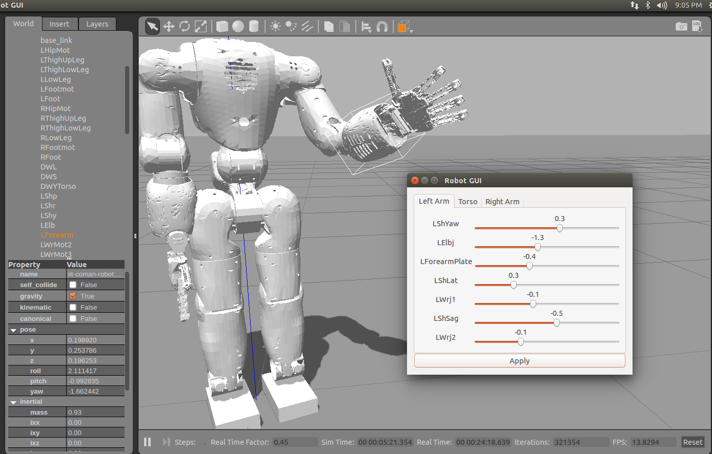

<div class="page-header">
  <h1>Getting Started</h1>
<!--   To get a feel for how the CogiMon modeling toolchain shall work and how you can use it to design control architecture for hybrid force and motion controllers, check out this intro video: -->
</div>

This document explain installation and test of the CogIMon Simulation Architecture (CoSimA) with support for IIT's COMAN and the KUKA LWRIV+ robot. Please check back often as we continuously extend this documentation.

### Software Installation

CoSimA is modeled in a Cognitive Interaction Toolkit (CITk) distribution for easily replication, which is available [here](https://toolkit.cit-ec.uni-bielefeld.de/systems/versions/cogimon-minimal-simulation-distribution-nightly). It has so far been tested on:
* Ubuntu Trusty (LTS 14.04) using Gazebo 6.5 / (LTS 7.1) and OROCOS-RTT 2.8
* OS X Yosemite (10.10) / El Capitan (10.11) using Gazebo (LTS 7.1) and OROCOS-RTT 2.8

The following configurations will be supported / tested soon:
* Ubuntu Xenial (16.04) using Gazebo (LTS 7.1) and OROCOS-RTT 2.9
* OS X El Capitan (10.11) using Gazebo (LTS 7.1) and OROCOS-RTT 2.9

#### Bootstrap the CITk environment

1. Setup the CITk toolchain on your machine according to the instructions [here](https://toolkit.cit-ec.uni-bielefeld.de/tutorials/bootstrapping)

	***Note:*** If the download from the stated server is slow, you may also download it from the mirror [here](https://www.dropbox.com/sh/1q6w0akfg9fji8t/AAADUDUkU2bCemCEHyoT3-nwa/jenkins.tar.gz?dl=0).

1. Clone the CITk recipe repository

	***Note:*** The ```$prefix``` environment variable should point to the top-level install prefix of the bootstrapped CITk. You may set it in bash using a command such as ```export prefix=/some/install/path``` that you need to modify according to your preferences.

		cd $prefix
		mkdir dist
		cd dist
		git clone https://opensource.cit-ec.de/git/citk .

#### Install Gazebo 

##### The following commands add Gazebo repositories for binary installation to your system. 

1. Setup your computer to accept software from packages.osrfoundation.org.

    ***Note:*** there is a list of [available mirrors](https://bitbucket.org/osrf/gazebo/wiki/gazebo_mirrors) for this repository which could improve the download speed.

        sudo sh -c 'echo "deb http://packages.osrfoundation.org/gazebo/ubuntu-stable `lsb_release -cs` main" > /etc/apt/sources.list.d/gazebo-stable.list'

1. Setup keys.

        wget http://packages.osrfoundation.org/gazebo.key -O - | sudo apt-key add -

1. Update Package Cache.

        sudo apt-get update

[In case you experience any problems at this stage, please consult the Gazebo installation  guidelines](http://gazebosim.org/tutorials?tut=install_ubuntu&cat=install)

#### Install CoSimA

1. Install the ```cogimon-minimal-nightly``` distribution as explained [here](https://toolkit.cit-ec.uni-bielefeld.de/systems/versions/cogimon-minimal-simulation-distribution-nightly). In particular you need to install the system dependences and call the build generator for the CoSimA distribution.

	***Note:*** 

	* You need to replace the ```$prefix``` in the build generator arguments with the expanded directory location
	* You may add ```--cache-directory``` to the build generator command in order to speed up repeated job generation
	* You may replace your password with the Jenkins API token that can be retrieved from your Jenkins user profile

	A full example of the command line call may look similar to the following:

		./jenkins/job-configurator --on-error=continue -d ./citk/distributions/cogimon-minimal-nightly.distribution -t './citk/templates/toolkit/*.template' -u ndehio -a 8c4ccaed525d91b0ea9de6f94bdbdd31 -D toolkit.volume=/vol/coman --delete-other --cache-directory=/home/ndehio/.buildgen

2. In your local [Jenkins build server](https://localhost:8080) trigger the ```distribution-buildflow-cogimon-minimal-nightly``` job (only possible after login).

3. Wait for completion and check that all bullets are blue after the individual build has passed. Jenkins builds and installs the packages to the specified toolkit volume (see command line above).

### System Test

The system can be manually tested in your environment if you follow the following steps. The commands shown here assume that you execute them in a  terminal using bash.

#### Start the RSB Server process

```bash
source $prefix/cogimon-minimal-nightly/bin/setup-cogimon-env.sh
rsb0.14 server
```

You should see some output confirming that the server has started.

#### Start the RTT Deployer console

```bash
source $prefix/cogimon-minimal-nightly/bin/setup-cogimon-env.sh
deployer-gnulinux
```

You should get a shell-style prompt, which allows you to interact with the RTT environment.

#### Load and start the required CoSimA components

Please type within the deployer-console (replace $prefix with the expanded installation prefix):

```bash
loadService("this","scripting")
scripting.runScript("$prefix/cogimon-minimal-nightly/etc/cogimon-scenarios/scenario-coman/coman_bring_up_kinchains.ops")
```

You should see quite some output in the deployer that you may ignore for now.

#### Start an RSB Logger process (optional)

```bash
source $prefix/cogimon-minimal-nightly/bin/setup-cogimon-env.sh
rsb0.14 logger socket:/
```

You should see a data stream that sends joint feedback with 100Hz.

#### Start the Gazebo client process

```bash
source $prefix/cogimon-minimal-nightly/bin/setup-cogimon-env.sh
gzclient
```

You should see the robot in the Gazebo front end.

#### Start the Robot Gui to make the robot move

```bash
source $prefix/cogimon-minimal-nightly/bin/setup-cogimon-env.sh
rsb-robot-gui1.0
```

You should see a basic robot gui that allows you to set a joint configuration that is send to the simulated robot once you apply the values. At the end of this step the Gazebo frontend and the robot GUI should look similar to the following screenshot:




<!-- TODO:
* Add link and explanation to CITk distribution / experiment -->

<!-- <p>
  <iframe id="player" type="text/html" width="640" height="390"
      src="http://www.youtube.com/embed/AuTo_6id3J8?enablejsapi=1&origin=http://docs.jetstrap.com/"
        frameborder="0"></iframe>

</p>
 -->
